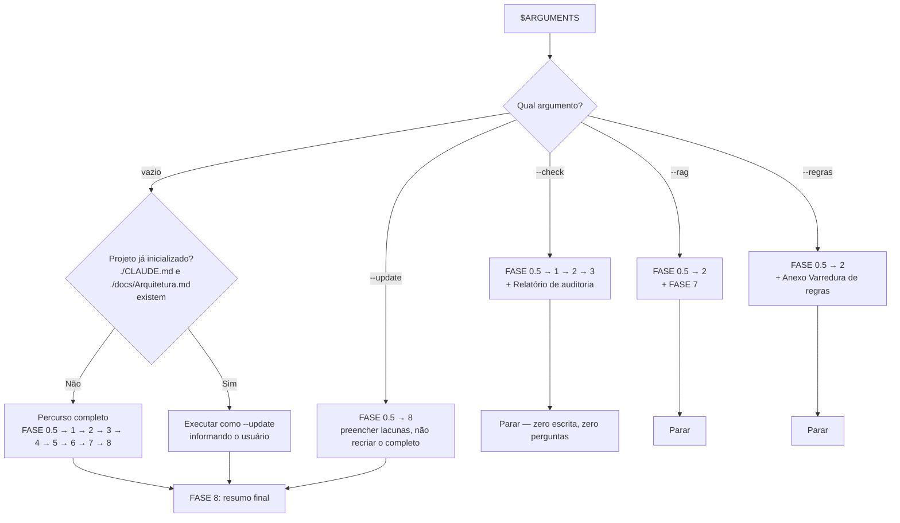
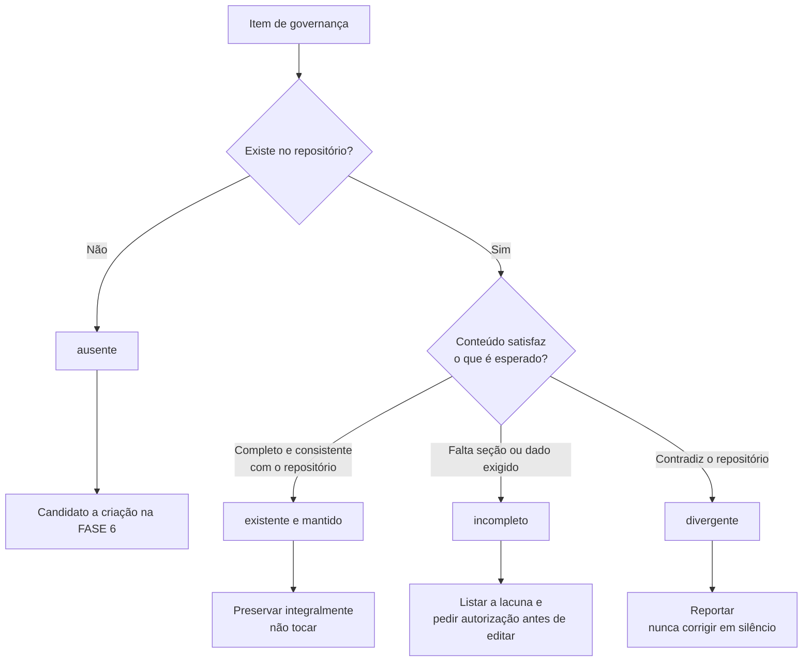
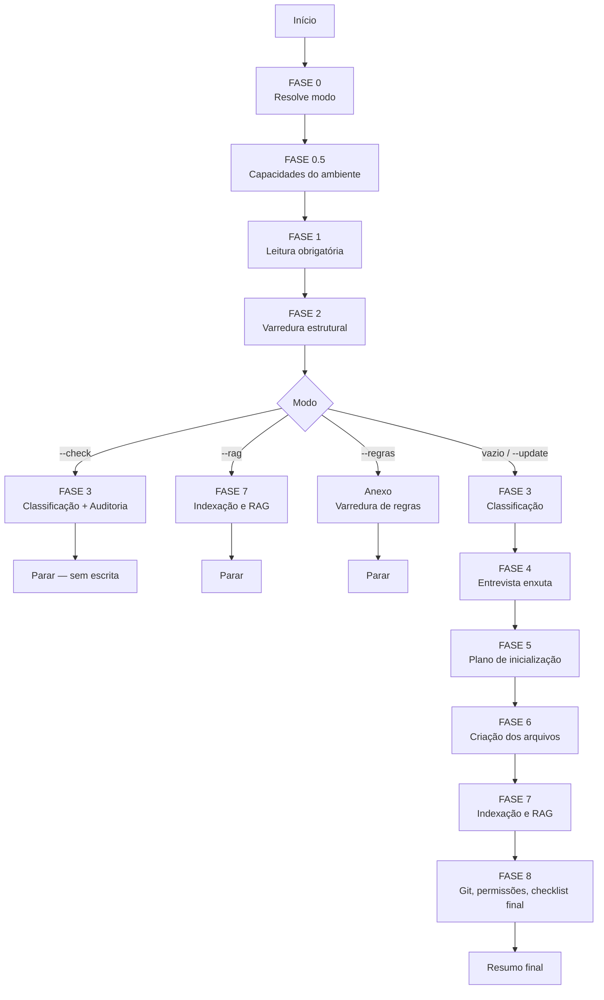

# init-project

Inicialize, audite ou atualize a estrutura de governança deste projeto.

Executar na raiz do projeto.

Argumentos recebidos: `$ARGUMENTS`

---

## Regra principal

Antes de criar planos, ler código, executar comandos ou modificar qualquer arquivo:

1. Ler `~/.claude/CLAUDE.md`.
2. Ler `./CLAUDE.md`, se existir.
3. Ler a documentação local existente.
4. Verificar o estado do Git.
5. Identificar dúvidas e conflitos.
6. Perguntar ao usuário o que não for detectável.
7. Criar o plano de inicialização.
8. Executar apenas o que foi autorizado.
9. Validar e apresentar o resumo final.

Nunca criar um plano antes de ler o `CLAUDE.md` global e o local.

Ao iniciar, informar:

```text
Instruções globais e documentação local verificadas. Iniciando a análise do projeto.
```

### Este comando não é o mecanismo de manutenção

`/init-project` **cria e audita** a estrutura de governança. Ele não é o que mantém a documentação em dia.

A manutenção contínua é regida pela seção `Sincronização obrigatória de documentação` de `~/.claude/CLAUDE.md`: ao fim de **toda** implementação, os onze documentos são avaliados pela tabela de gatilhos e cada um recebe um estado explícito — `atualizado`, `criado`, `sem alteração` ou `n/a`. Documento condicional ausente cujo gatilho disparou é criado na hora, a partir do template correspondente, sem esperar por este comando.

Se a auditoria deste comando encontrar documentação defasada, isso é sintoma de sincronização não executada — reportar como tal, e não apenas corrigir.

---

## Regras fundamentais

- Nunca sobrescrever arquivos existentes sem confirmação explícita.
- Nunca remover arquivos automaticamente.
- Nunca remover branches.
- Nunca executar `git reset` destrutivo.
- Nunca descartar alterações não commitadas.
- Nunca alterar remotes sem autorização.
- Nunca alterar migrações sem autorização.
- Nunca registrar senhas, tokens ou chaves privadas.
- Nunca criar secrets reais nos arquivos.
- Nunca indexar segredos ou dados pessoais em RAG.
- Fazer perguntas quando houver dúvida.
- Registrar `a definir` quando uma decisão ainda não existir — nunca inventar.
- Preservar o histórico do projeto.
- Criar planos curtos, objetivos e orientados à execução.

---

## FASE 0 — Modo de execução

Resolver o modo a partir de `$ARGUMENTS`:

| Modo | Comportamento |
| --- | --- |
| _(sem argumento)_ | Detecta o estado e inicializa o que estiver faltando |
| `--check` | **Auditoria somente leitura.** Compara documentação com a realidade do repositório. Zero escrita, zero perguntas |
| `--update` | Preenche lacunas dos documentos existentes, sem recriar o que já está completo |
| `--rag` | Apenas reindexa e atualiza `docs/RAG.md` |
| `--regras` | Varredura profunda para popular `docs/RegrasNegocio.md` a partir do código |

Detectar se o projeto já está inicializado: existe `./CLAUDE.md` **e** `./docs/Arquitetura.md`.

A FASE 0.5 roda em **todos** os modos: sem saber o que existe no ambiente, nenhum modo é confiável.

- Projeto novo, sem argumento → percurso completo (FASE 0.5 → 8).
- Projeto já inicializado, sem argumento → executar como `--update`, informando isso ao usuário.
- `--check` → executar FASE 0.5, 1, 2, 3 e o relatório de auditoria. Parar. Não escrever nada.
- `--rag` → executar FASE 0.5, 1, 2 e 7. Parar.
- `--regras` → executar FASE 0.5, 1, 2 e o anexo `Varredura de regras`. Parar.

### Diagrama do roteamento



---

## FASE 0.5 — Capacidades disponíveis

O comando não pode assumir que o ambiente do usuário é igual ao seu. Detectar antes de citar.

```bash
bash ~/.claude/templates/init-project/_scan.sh capacidades
```

Este modo **não é cacheado**, de propósito: a invalidação natural seria o mtime de `agents/` e `skills/`, que não muda quando um frontmatter é editado no lugar — justamente o caso que a varredura precisa detectar. É também o modo barato, então não há o que economizar.

E tentar `list_corpora` — a única capacidade que o script não consegue verificar, por ser MCP.

Esta chamada e a tentativa de `list_corpora` não dependem de nada da FASE 1 (nem o contrário) — emitir junto com as leituras da FASE 1 na mesma mensagem, em vez de esperar uma fase terminar para começar a outra.

Montar a tabela e apresentá-la:

| Capacidade | Uso | Se faltar |
| --- | --- | --- |
| MCP `claude-mem` | corpora, `smart_search`, `observation_search` | Glob/Grep com escopo; `docs/RAG.md` registra "sem backend de RAG" |
| skill `archify` (indispensável) | gerar/atualizar `docs/arquitetura.html` a partir de `docs/Arquitetura.md` | pular a geração, registrar pendência em `docs/RAG.md` e no resumo final |
| skill `graphify` | grafo opcional do projeto | segue sem grafo, registrado em `docs/RAG.md` |
| agentes do harness | delegação nos pontos caros | papéis executados inline |
| skill `ui-ux-pro-max` | apoio ao `docs/Frontend.md` | design system vem da entrevista |

Regras:

- **Ausência degrada, nunca interrompe.** O comando conclui em qualquer ambiente — inclusive sem `archify`: "indispensável" qualifica o quanto ela é usada (sempre tentada, nunca apenas sugerida), não uma condição de bloqueio.
- Se algo ausente for **relevante para este projeto**, ler sob demanda `~/.claude/templates/init-project/_capacidades.md` e informar como instalar. Sem frontend, não sugerir `ui-ux-pro-max`.
- **Nunca instalar nada.** Não rodar `/plugin`, não editar `settings.json`. A instrução é informativa.
- Levar a tabela para o resumo final e para `docs/RAG.md`.

Em `--check`, apenas reportar. Não sugerir instalação.

---

## FASE 1 — Leitura obrigatória

Ler, nesta ordem:

1. `~/.claude/CLAUDE.md`
2. `./CLAUDE.md`
3. `./docs/RegrasNegocio.md`
4. `./docs/Arquitetura.md`
5. `./docs/Organograma.md`
6. `./docs/Infraestrutura.md`
7. `./docs/API.md`
8. `./docs/Frontend.md`
9. `./docs/Auth.md`
10. `./docs/RAG.md`
11. `./docs/Progresso.md`
12. `./docs/Memoria.md`
13. `./docs/Harness.md`

Ler apenas os que existirem. Se algum não puder ser lido, informar o motivo e seguir.

Não ler nem executar arquivos desconhecidos sem necessidade.

Nenhuma destas leituras depende do resultado de outra: emitir todas em lote, como chamadas paralelas na mesma mensagem, em vez de uma leitura sequencial por vez.

---

## FASE 2 — Detecção em uma passada

**Uma chamada, não quinze.** O script faz a varredura estrutural inteira — manifestos, locks, Docker, build, diretórios de código e teste, migrações, contratos de API, ambiente, governança, `graphify-out/`, Git e volume:

```bash
bash ~/.claude/templates/init-project/_scan.sh projeto
```

Somente leitura sobre o projeto. Não imprime conteúdo de `.env`, secret ou credencial — arquivos de ambiente aparecem apenas como nome e estado de versionamento.

### Cache

A saída é cacheada em `~/.claude/.scan-cache/`, fora do repositório: o projeto continua intocado e não precisa de `.gitignore`. A entrada é invalidada quando muda o mtime de `.git/HEAD`, `.git/index`, da raiz, de `docs/`, de `.claude/` ou do próprio `_scan.sh`, e expira em 6 h de qualquer forma.

- O hook `SessionStart` já roda `_scan.sh sessao` ao abrir a sessão, então esta chamada normalmente acerta o cache e volta instantânea.
- O cache pode não enxergar um arquivo novo em subdiretório profundo ainda não adicionado ao Git. Quando a precisão importar, usar `--no-cache`.
- Em `--check`, usar **sempre** `--no-cache`: auditoria não pode ler cache velho.

```bash
bash ~/.claude/templates/init-project/_scan.sh projeto --no-cache
```

Depois do script, e **somente** com o que ele encontrou:

1. **Manifestos** — ler apenas os listados em `[MANIFESTOS]`, para extrair linguagem, framework, gerenciador de pacotes, scripts e dependências relevantes (ORM, auth, testes, UI).
2. **Telas e rotas** — quando houver frontend, localizar o arquivo de rotas e extrair rota → componente. Alimenta o índice de telas do `RegrasNegocio.md`. Preferir `smart_search` à leitura de arquivos inteiros.

### Delegação em repositório grande

Se a saída trouxer `sugerir_delegacao: sim` (mais de ~500 arquivos de código ou mais de 3 diretórios de aplicação) **e** o agente `Explore` estiver disponível pela FASE 0.5:

- **Perguntar** se deve delegar o levantamento de stack e rotas a `Explore`.
- Se autorizado, o agente devolve **apenas o resumo estruturado** — nunca conteúdo de arquivo.
- Se recusado ou indisponível, seguir inline. Repositório pequeno não delega: o overhead do subagente supera o ganho.

### Saída

Resumo estruturado com stack, gerenciador, banco, ORM, autenticação, API, Docker, testes, telas detectadas, migrações, Git e backend de RAG.

**Não modificar nada nesta fase.**

---

## FASE 3 — Verificação e preservação

Classificar cada item de governança:

```text
CLAUDE.md
docs/RegrasNegocio.md
docs/Arquitetura.md
docs/arquitetura.html
docs/Organograma.md
docs/RAG.md
docs/Harness.md
docs/Progresso.md
docs/Memoria.md
docs/API.md
docs/Frontend.md
docs/Auth.md
docs/Infraestrutura.md
.gitignore
.gitattributes
.claude/settings.local.json
.claude/plans/
.git/
```

| Classificação | Ação |
| --- | --- |
| `ausente` | Candidato a criação |
| `existente e mantido` | Preservar integralmente. Não tocar |
| `incompleto` | Listar a lacuna e **pedir autorização** antes de editar |
| `divergente` | Documentação contradiz o repositório. Reportar; nunca corrigir em silêncio |

`docs/arquitetura.html` é exceção à regra de "existente e mantido: não
tocar": é um artefato derivado de `docs/Arquitetura.md`, sempre regenerável
via `archify` quando o `.md` mudar. Sobrescrever esse HTML não é uma violação
de preservação, desde que o conteúdo continue refletindo fielmente o `.md`.

### Diagrama de classificação



Em `--check`, todas as ações acima terminam no relatório de auditoria — nenhuma escrita acontece de fato.

Nenhum arquivo existente é sobrescrito. Ponto.

### Relatório de auditoria (`--check` para aqui)

Apresentar:

- Tabela de cada item com sua classificação.
- Divergências entre documentação e realidade (ex.: `docs/API.md` cita endpoint que não existe mais).
- Documentos condicionais que deveriam existir e não existem (ex.: há frontend, não há `docs/Frontend.md`).
- **Sincronização não executada** — documentos cujo gatilho aparentemente disparou sem atualização correspondente. Comparar as últimas linhas de `docs/Progresso.md` e os commits recentes com a tabela de gatilhos: código de rota alterado sem toque em `docs/API.md`, componente novo sem toque em `docs/Frontend.md`, `Dockerfile` alterado sem toque em `docs/Infraestrutura.md`. Reportar como falha de processo, não como lacuna de inicialização.
- Regras `⚠ inferida` ou `a definir` pendentes em `docs/RegrasNegocio.md`.
- Tabela de capacidades da FASE 0.5, sem sugerir instalação.
- Divergência entre a tabela de papéis de `docs/Harness.md` e os agentes que existem hoje.
- Estado do RAG.
- Riscos de segurança evidentes (`.env` versionado, secrets em Compose).

Encerrar sem escrever nada.

---

## FASE 4 — Entrevista enxuta

O objetivo é perguntar **pouco e bem**. O que foi detectado não vira pergunta; vira confirmação.

### Passo 1 — Confirmação em bloco

Apresentar o resumo da FASE 2 e pedir uma única confirmação. Corrigir o que o usuário apontar.

### Passo 2 — Perguntar apenas o não detectável

Usar `AskUserQuestion`, em lotes de até 4 perguntas, com a opção recomendada primeiro.

Pular blocos inteiros que não se apliquem: sem frontend, nenhuma pergunta de frontend; sem API, nenhuma pergunta de API.

Tipicamente **não** é detectável:

- Objetivo de negócio do projeto.
- Restrições operacionais, legais ou de compliance.
- O que nunca pode ser removido ou alterado.
- Papéis de usuário e o que cada um pode fazer.
- Estratégia de deploy e responsável.
- Decisões ainda não tomadas.

### Checklist de cobertura

Ler agora, e somente agora:

```text
~/.claude/templates/init-project/_checklist-entrevista.md
```

A entrevista só termina quando cada item daquele checklist estiver respondido, detectado ou marcado `a definir`. Resposta desconhecida vira `a definir`, nunca invenção.

---

## FASE 5 — Plano de inicialização

Criar `.claude/plans/` se não existir.

Nome obrigatório:

```text
<nome-da-pasta-do-projeto>-<AAAA-MM-DD-HH-MM>-inicializacao-governanca.md
```

Conflito de nome → acrescentar `-v02`, `-v03`. Nunca sobrescrever.

Conteúdo:

```markdown
# Plano: Inicialização da governança

## Objetivo

Configurar documentação, regras de negócio, RAG, fluxo de desenvolvimento, Git e permissões locais sem sobrescrever arquivos existentes.

## Arquivos a criar

- [lista]

## Arquivos preservados

- [lista]

## Arquivos que precisam de autorização para atualização

- [lista]

## Ações de RAG

- [lista]

## Ações Git

- [lista]

## Sincronização de documentação

Estado **previsto** de cada documento ao fim desta tarefa. Seção obrigatória em todo plano, conforme a seção `Sincronização obrigatória de documentação` de `~/.claude/CLAUDE.md`.

| Documento | Previsto | Motivo |
| --- | --- | --- |
| `docs/RegrasNegocio.md` | [atualizado / criado / sem alteração / n/a] | [GATILHO OU AUSÊNCIA DE GATILHO] |
| `docs/Arquitetura.md` | [ESTADO] | [MOTIVO] |
| `docs/Organograma.md` | [ESTADO] | [MOTIVO] |
| `docs/Infraestrutura.md` | [ESTADO] | [MOTIVO] |
| `docs/API.md` | [ESTADO] | [MOTIVO] |
| `docs/Frontend.md` | [ESTADO] | [MOTIVO] |
| `docs/Auth.md` | [ESTADO] | [MOTIVO] |
| `docs/RAG.md` | [ESTADO] | [MOTIVO] |
| `docs/Progresso.md` | atualizado | sempre |
| `docs/Memoria.md` | [ESTADO] | [MOTIVO] |
| `docs/Harness.md` | [ESTADO] | [MOTIVO] |

## Validação

- [lista]

## Riscos e decisões pendentes

- [lista]
```

Na inicialização de um projeto novo, a coluna `Previsto` traz `criado` para os documentos que este comando vai gerar e `n/a` para os condicionais que o projeto não justifica.

Solicitar confirmação antes de qualquer ação potencialmente destrutiva.

---

## FASE 6 — Criação dos arquivos

Cada template é um arquivo próprio em `~/.claude/templates/init-project/`, no formato `<Nome>.md.tpl.md`.

**Ler somente os templates que serão de fato usados.**

| Destino | Template | Quando criar |
| --- | --- | --- |
| `CLAUDE.md` | `CLAUDE.md.tpl.md` | Sempre |
| `docs/RegrasNegocio.md` | `RegrasNegocio.md.tpl.md` | Sempre |
| `docs/Arquitetura.md` | `Arquitetura.md.tpl.md` | Sempre |
| `docs/arquitetura.html` | gerado via skill `archify` (tipo `architecture`) a partir de `docs/Arquitetura.md` — não é um `.tpl.md` | Sempre, quando a skill `archify` estiver disponível |
| `docs/Organograma.md` | `Organograma.md.tpl.md` | Sempre |
| `docs/RAG.md` | `RAG.md.tpl.md` | Sempre |
| `docs/Harness.md` | `Harness.md.tpl.md` | Sempre |
| `docs/Progresso.md` | `Progresso.md.tpl.md` | Sempre |
| `docs/Memoria.md` | `Memoria.md.tpl.md` | Sempre |
| `docs/API.md` | `API.md.tpl.md` | Expõe API própria ou consome API externa relevante |
| `docs/Frontend.md` | `Frontend.md.tpl.md` | Há frontend |
| `docs/Auth.md` | `Auth.md.tpl.md` | Há autenticação |
| `docs/Infraestrutura.md` | `Infraestrutura.md.tpl.md` | Há Docker, deploy ou infraestrutura gerenciada |

### Preenchimento

- Substituir cada `[PLACEHOLDER]` pelo valor confirmado.
- Placeholder sem resposta vira `a definir` — nunca um valor inventado.
- Remover linhas de exemplo das tabelas quando houver dados reais; mantê-las como modelo quando a tabela estiver vazia.
- Nunca escrever valor real de secret. Apenas nome e origem.
- Em `docs/Harness.md`, preencher a coluna **Neste projeto** com o agente detectado na FASE 0.5 — ou `inline` quando ele não existir neste ambiente. Papel sem agente continua sendo papel obrigatório.
- Em `docs/RAG.md`, preencher a tabela de capacidades com o resultado da FASE 0.5, datado.
- Gerar `docs/arquitetura.html`, quando a skill `archify` estiver disponível: ler stack, camadas, diagrama de fluxo de dados e integrações externas de `docs/Arquitetura.md` recém-criado; modelar como especificação JSON do tipo `architecture` da `archify`; validar com `node bin/archify.mjs validate architecture <candidate.json> --quality showcase --json`; entregar com `node bin/archify.mjs deliver architecture <candidate.json> docs/arquitetura.html --quality showcase --json`. Ausente a skill, pular e registrar a pendência no resumo final e em `docs/RAG.md`.
- Em `CLAUDE.md`, seção `Sincronização de documentação`, preencher o estado inicial dos quatro documentos condicionais a partir do que a FASE 2 detectou: `EXISTE` quando o documento for criado agora, `n/a` quando o projeto não o justificar. Este bloco é detectável — não vira pergunta na entrevista. `n/a` aqui não é permanente: o documento passa a ser obrigatório assim que o gatilho correspondente disparar em alguma implementação.

### Esqueleto do `docs/RegrasNegocio.md`

Na criação, preencher com o que a FASE 2 detectou de forma verificável e marcar o resto:

- **Índice de telas** — uma linha por rota detectada (ID, tela, rota, arquivo), com `Regras` e `Status` em `a definir`.
- **Entidades** — uma seção por modelo/entidade detectada, com estados extraídos de enums quando existirem, marcados `⚠ inferida`.
- **Glossário** — termos do domínio confirmados na entrevista.
- **Matriz de permissões** — papéis confirmados; células em `a definir`.

Não inventar regra. O esqueleto existe para ser preenchido conforme o trabalho acontece, ou de uma vez por `--regras`.

---

## FASE 7 — Indexação e RAG

1. **Reaproveitar a detecção da FASE 0.5** — backend disponível e `graphify-out/` já foram levantados. Não detectar de novo. Se `claude-mem` estiver ausente, registrar o fallback em `docs/RAG.md` e pular direto ao passo 5.
2. **Definir exclusões** antes de qualquer indexação: `.env`, secrets, chaves, certificados, tokens, dumps e fixtures com dados pessoais, logs de produção.
3. **Perguntar antes de qualquer operação cara.** Nunca executar automaticamente:
   - `/learn-codebase` lê todo arquivo-fonte na íntegra — só com confirmação explícita;
   - `/graphify` sobre um repositório grande — só com confirmação explícita.
4. **Construir os corpora**, se autorizado:
   - `<projeto>-geral` — visão geral do projeto;
   - `<projeto>-regras` — `types=decision,feature`, apoio ao `RegrasNegocio.md`.
5. **Escrever `docs/RAG.md`** refletindo o estado **real**: o que existe, o que não existe, o que foi recusado. Se nada foi indexado, registrar isso e o fallback (Glob/Grep com escopo).

`smart_search` não exige indexação — funciona direto sobre o disco e é sempre a primeira opção para localizar código.

---

## FASE 8 — Git, permissões e validação final

### Git

Verificar e **perguntar antes de agir**:

- É repositório Git? Se não, perguntar se deve inicializar.
- `.gitignore` cobre `.env`, secrets, artefatos de build, `node_modules`, `target/`, `graphify-out/`? Propor as adições; não aplicar sem confirmação.
- Branch principal e de desenvolvimento conforme decidido.
- Commit inicial apenas se o usuário autorizar.

Proibido, sem exceção: `git reset` destrutivo, remoção de branch, alteração de remote, descarte de alterações não commitadas.

### Permissões locais

`.claude/settings.local.json`: se não existir, propor um conteúdo mínimo. Se existir, **preservar** — apenas sugerir adições.

### Verificação de segurança

- `.env` está versionado? Alerta crítico.
- Há secret em `Dockerfile`, Compose ou documentação? Alerta crítico.
- Algum arquivo criado contém valor de credencial? Corrigir antes de concluir.

### Checklist final

- [ ] Documentos obrigatórios existem
- [ ] `docs/arquitetura.html` existe e reflete a versão atual de `docs/Arquitetura.md`, quando a skill `archify` estiver disponível
- [ ] Documentos condicionais aplicáveis existem
- [ ] `docs/Harness.md` tem a coluna **Neste projeto** preenchida com agente real ou `inline`
- [ ] Capacidades ausentes foram avisadas, com instrução de instalação, e o fallback foi aplicado
- [ ] Nenhum arquivo preexistente foi sobrescrito
- [ ] Nenhum placeholder foi preenchido com invenção
- [ ] Nenhum secret foi gravado
- [ ] `docs/RAG.md` reflete o estado real da indexação
- [ ] `docs/RegrasNegocio.md` tem índice de telas e entidades detectadas
- [ ] `docs/Organograma.md` existe e seus diagramas Mermaid refletem a lógica real do projeto, sem nós de exemplo ou placeholders esquecidos
- [ ] `CLAUDE.md` gerado tem a seção `Sincronização de documentação` com a tabela de gatilhos e o estado inicial dos condicionais preenchido
- [ ] `docs/Harness.md` gerado tem a tabela de sincronização no Coder e a verificação correspondente no Validator
- [ ] Plano salvo em `.claude/plans/`, com a seção `Sincronização de documentação` preenchida

### Resumo final

Informar:

- Arquivos criados.
- Arquivos preservados.
- Arquivos que precisam de autorização para atualização.
- **Estado de `docs/arquitetura.html`**: gerado / desatualizado / pendente por skill `archify` ausente.
- **Capacidades do ambiente**: o que está disponível, o que faltou, o fallback usado e como instalar o que for relevante.
- Estado do RAG e o que foi indexado.
- Pendências `a definir`, agrupadas por documento.
- Regras `⚠ inferida` aguardando confirmação.
- Riscos de segurança encontrados.
- Próximos passos sugeridos.

---

## Anexo — Visão geral do pipeline

Mapa de navegação do fluxo completo, útil para situar qualquer fase dentro do todo:



---

## Anexo — Varredura de regras (`--regras`)

Modo opt-in, caro e demorado. Executar somente quando pedido.

Ler o procedimento completo apenas neste modo:

```text
~/.claude/templates/init-project/_varredura-regras.md
```

Regra extraída de código pode ser **bug, não regra**. Nunca tratar `⚠ inferida` como verdade.
