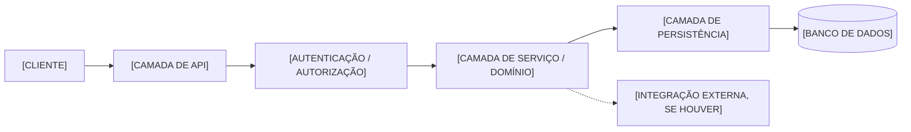
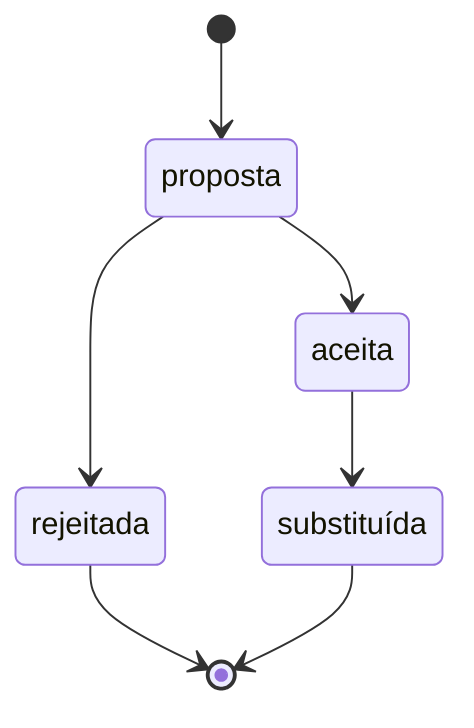

# Arquitetura — [NOME DO PROJETO]

Companion renderizado: `docs/arquitetura.html`, gerado e mantido pela skill
`archify` a partir do conteúdo deste arquivo. Regenerar sempre que este
arquivo mudar — ver `## Regras de alteração`.

## Objetivo

[OBJETIVO]

## Stack

- Frontend: [STACK]
- Backend: [STACK]
- Banco de dados: [BANCO]
- ORM: [ORM]
- Autenticação: [ESTRATÉGIA]
- API: [TIPO]
- Testes: [ESTRATÉGIA]
- Infraestrutura: [INFRAESTRUTURA]

## Estrutura de diretórios

```text
[MAPA REAL DO PROJETO]
```

## Padrões arquiteturais

[PADRÕES]

## Fluxo de dados

[COMO UMA REQUISIÇÃO ATRAVESSA O SISTEMA, DA ENTRADA À PERSISTÊNCIA]

Diagrama de exemplo — substituir cada `[CAMADA]` pela camada real deste
projeto, adicionar ou remover nós conforme a arquitetura real detectada/
confirmada na entrevista. Este é um esqueleto para o Coder preencher, nunca
uma arquitetura já decidida: nó sem correspondência real neste projeto deve
ser removido, não deixado com `[CAMADA]` vazio nem preenchido por invenção.



## Decisões arquiteturais

Ciclo de vida do campo `Status` de cada ADR:



### ADR-001 — [TÍTULO]

- Status: [proposta / aceita / substituída]
- Contexto: [CONTEXTO]
- Decisão: [DECISÃO]
- Alternativas: [ALTERNATIVAS CONSIDERADAS]
- Consequências: [CONSEQUÊNCIAS]

## Banco de dados

- Banco: [BANCO]
- ORM: [ORM]
- Migrações: [ESTRATÉGIA]
- Regra de migrações: [REGRA]
- Desenvolvimento: [AMBIENTE]
- Testes: [AMBIENTE]
- Produção: [AMBIENTE]

## Integrações externas

| Serviço | Finalidade | Autenticação | Ambiente | Observações |
| --- | --- | --- | --- | --- |
| [SERVIÇO] | [FINALIDADE] | [TIPO] | [AMBIENTE] | [OBSERVAÇÕES] |

## Segurança

- Secrets devem vir de variáveis de ambiente ou secret manager.
- Secrets nunca devem ser versionados.
- Senhas devem usar Argon2id.
- Logs não devem conter credenciais.
- [OUTRAS REGRAS]

## Pontos a definir

- [ITEM]

## Regras de alteração

Gatilho de atualização deste documento: camada, módulo, padrão, dependência, fluxo de dados, schema ou decisão arquitetural mudou.

Antes de alterar:

1. Consultar este arquivo.
2. Consultar `docs/RegrasNegocio.md` se a alteração muda comportamento.
3. Verificar se já existe padrão ou módulo equivalente.
4. Avaliar impacto em camadas, dependências e migrações.
5. Implementar.
6. Registrar uma ADR quando a decisão for estrutural e não reversível de graça.
7. Atualizar este arquivo.
8. Regenerar `docs/arquitetura.html` via skill `archify` (tipo `architecture`), quando a skill estiver disponível.
9. Atualizar as regras de negócio afetadas.
10. Atualizar testes.
11. Executar Validator.
12. Executar Tester.
13. Executar Security Specialist.
14. Atualizar o histórico.

## Histórico

| Data | Área | Alteração | ADR | Motivo |
| --- | --- | --- | --- | --- |
| [DATA] | [CAMADA / MÓDULO / SCHEMA] | [ALTERAÇÃO] | [ADR-... OU "n/a"] | [MOTIVO] |
