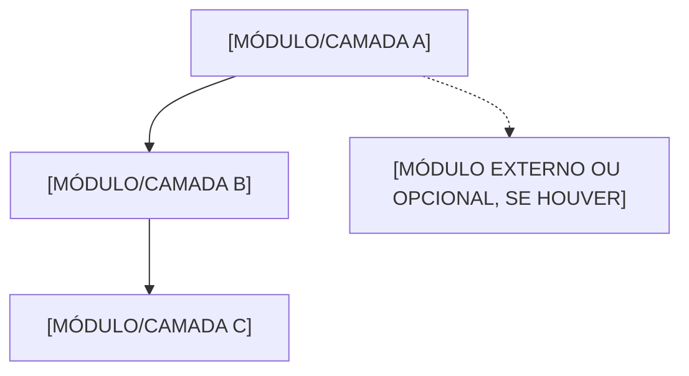
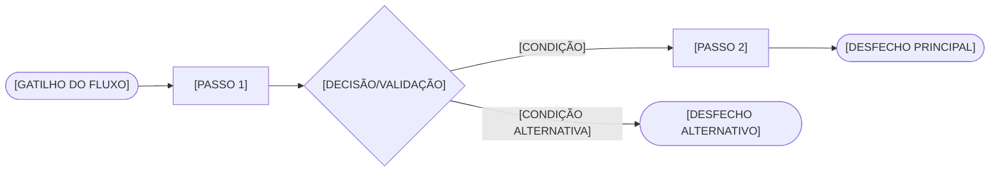
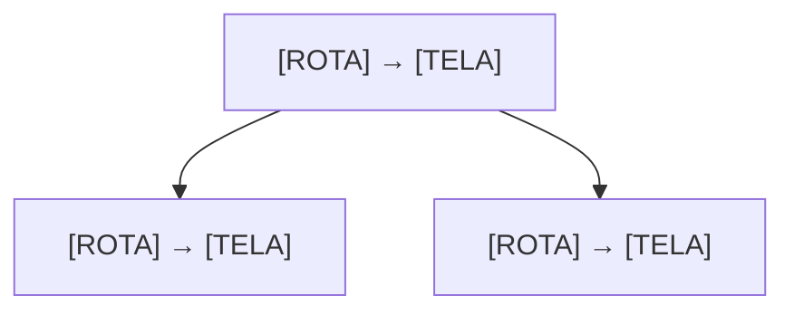
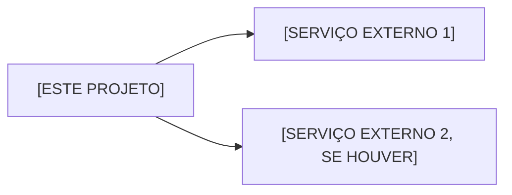

# Organograma — [NOME DO PROJETO]

## Objetivo

Mapa visual vivo da lógica do projeto: como os módulos se relacionam, como o fluxo de negócio principal atravessa o sistema, como as telas se conectam e quais integrações externas existem.

Este documento é complementar a `docs/Arquitetura.md`, não um substituto: `Arquitetura.md` registra decisões e stack em texto; `Organograma.md` é a visão diagramada, em Mermaid, de tudo isso junto. Sempre que a lógica do projeto mudar de um jeito que tornaria um destes diagramas enganoso, este arquivo precisa ser atualizado — ver `## Regras de alteração`.

Os diagramas abaixo são esqueletos. Nó sem correspondência real neste projeto deve ser **removido**, nunca deixado como `[PLACEHOLDER]` vazio nem preenchido por invenção. Seção inteira sem conteúdo aplicável (ex.: projeto sem frontend) deve ser marcada `n/a`, não apagada.

## Visão geral de módulos

Módulos, camadas ou serviços reais deste projeto e como se relacionam.

## Fluxo de negócio principal

Diagrama do(s) fluxo(s) de negócio mais importantes do projeto. `docs/RegrasNegocio.md` é a fonte da verdade textual das regras por trás de cada passo — este diagrama é a leitura visual delas, não uma cópia.

## Navegação de telas

Aplicável apenas quando o projeto tem frontend. Sem frontend, marcar esta seção como `n/a`.

Rota → tela, espelhando o índice de telas de `docs/RegrasNegocio.md`.

## Integrações externas

Pontos de integração deste projeto, em forma visual — espelha a tabela de integrações de `docs/Arquitetura.md`.

## Regras de alteração

Gatilho de atualização deste documento: módulo, camada, fluxo de negócio, tela, integração externa ou relação entre componentes mudou de forma que algum diagrama acima fique desatualizado.

Antes de alterar:

1. Consultar este arquivo.
2. Consultar `docs/Arquitetura.md` e `docs/RegrasNegocio.md` para confirmar se a mudança é real e não apenas de implementação interna.
3. Implementar a mudança.
4. Atualizar o(s) diagrama(s) afetado(s) — adicionar, remover ou renomear nós conforme a realidade nova.
5. Remover nó ou seção que deixou de existir; não deixar diagrama descrevendo algo que já foi removido do projeto.
6. Atualizar o histórico.

## Histórico

| Data | Área | Alteração | Motivo |
| --- | --- | --- | --- |
| [DATA] | [MÓDULO / FLUXO / TELA / INTEGRAÇÃO] | [ALTERAÇÃO] | [MOTIVO] |
